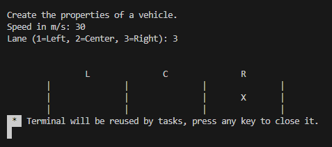

# Exercise

In this exercise, we will start with a project that will be extended over time.  
The scenario will be an car driving on a highway with three lanes.  
For this exercise, we will read-in the following information from the console:

- The current speed (in meter per second *$\frac{m}{s}$*) of our vehicle
- The current lane (There are three lanes in total)

The lane will be represented by an enum **LaneAssociationType** with the following properties:

- Left Lane
- Center Lane
- Right Lane
- Unknown Lane (Error case)

After reading in the information produce the following console output:



## Main Function

```c
int main()
{
    printf("Create the properties of a vehicle.\n");


    return 0;
}
```
